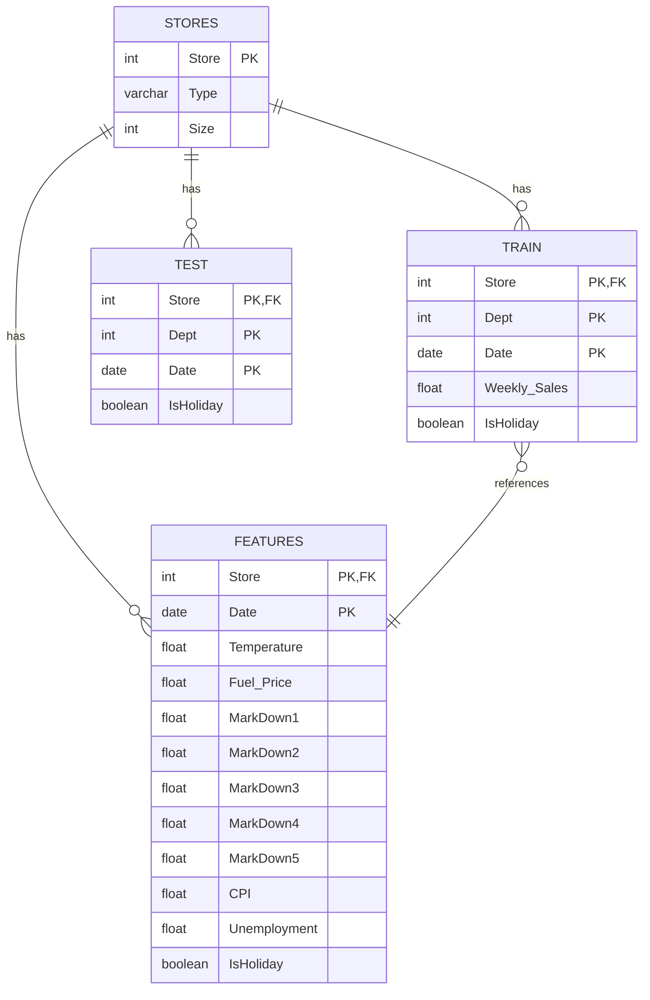

# Entity Relationship Diagram (ERD) - Walmart Sales Forecasting

## Mô tả tổng quan
Hệ thống cơ sở dữ liệu Walmart Sales Forecasting bao gồm 4 bảng chính với các mối quan hệ thông qua Primary Key (PK) và Foreign Key (FK).

---

## 📊 Sơ đồ ERD

```
┌─────────────────────────────────┐
│         STORES                  │
├─────────────────────────────────┤
│ 🔑 Store (PK)                   │
│    Type                         │
│    Size                         │
└─────────────────────────────────┘
         │
         │ 1
         │
         │ *
         ├──────────────────────────────────────┐
         │                                      │
         ▼                                      ▼
┌─────────────────────────────────┐    ┌─────────────────────────────────┐
│         TRAIN                   │    │         FEATURES                │
├─────────────────────────────────┤    ├─────────────────────────────────┤
│ 🔑 Store (PK, FK)               │    │ 🔑 Store (PK, FK)               │
│ 🔑 Dept (PK)                    │    │ 🔑 Date (PK)                    │
│ 🔑 Date (PK)                    │    │    Temperature                  │
│    Weekly_Sales                 │    │    Fuel_Price                   │
│    IsHoliday                    │    │    MarkDown1                    │
│                                 │    │    MarkDown2                    │
│                                 │    │    MarkDown3                    │
│                                 │    │    MarkDown4                    │
│                                 │    │    MarkDown5                    │
│                                 │    │    CPI                          │
│                                 │    │    Unemployment                 │
│                                 │    │    IsHoliday                    │
└─────────────────────────────────┘    └─────────────────────────────────┘
         │
         │ Tương tự
         │
         ▼
┌─────────────────────────────────┐
│         TEST                    │
├─────────────────────────────────┤
│ 🔑 Store (PK, FK)               │
│ 🔑 Dept (PK)                    │
│ 🔑 Date (PK)                    │
│    IsHoliday                    │
└─────────────────────────────────┘
```

---

## 📋 Chi tiết các bảng

### 1. 🏪 **STORES** (Bảng tra cứu)
Chứa thông tin về các cửa hàng Walmart.

| Cột | Kiểu | Ràng buộc | Mô tả |
|-----|------|-----------|-------|
| **Store** | INTEGER | **PK** | Mã định danh cửa hàng (1-45) |
| Type | VARCHAR(1) | NOT NULL | Loại cửa hàng (A, B, C) |
| Size | INTEGER | NOT NULL | Diện tích sàn bán hàng (sq ft) |

**Đặc điểm:**
- ✅ 45 dòng dữ liệu (45 cửa hàng)
- ✅ Không có giá trị NULL
- ✅ Bảng tham chiếu chính (Parent table)

---

### 2. 📈 **TRAIN** (Dữ liệu huấn luyện)
Chứa dữ liệu lịch sử bán hàng cho việc huấn luyện mô hình.

| Cột | Kiểu | Ràng buộc | Mô tả |
|-----|------|-----------|-------|
| **Store** | INTEGER | **PK, FK → STORES.Store** | Mã cửa hàng |
| **Dept** | INTEGER | **PK** | Mã phòng ban/ngành hàng |
| **Date** | DATE | **PK** | Ngày bán hàng (theo tuần) |
| Weekly_Sales | FLOAT | NOT NULL | Doanh số bán hàng hàng tuần |
| IsHoliday | BOOLEAN | NOT NULL | Cờ đánh dấu tuần lễ |

**Đặc điểm:**
- ✅ 421,570 dòng dữ liệu
- ✅ Composite Primary Key: (Store, Dept, Date)
- ✅ Thời gian: 05/02/2010 → 01/11/2012
- ⚠️ Weekly_Sales có thể âm (trả hàng)

---

### 3. 🧪 **TEST** (Dữ liệu dự đoán)
Chứa dữ liệu cần dự đoán Weekly_Sales.

| Cột | Kiểu | Ràng buộc | Mô tả |
|-----|------|-----------|-------|
| **Store** | INTEGER | **PK, FK → STORES.Store** | Mã cửa hàng |
| **Dept** | INTEGER | **PK** | Mã phòng ban/ngành hàng |
| **Date** | DATE | **PK** | Ngày bán hàng (theo tuần) |
| IsHoliday | BOOLEAN | NOT NULL | Cờ đánh dấu tuần lễ |

**Đặc điểm:**
- ✅ 115,064 dòng dữ liệu
- ✅ Composite Primary Key: (Store, Dept, Date)
- ✅ Cấu trúc tương tự TRAIN nhưng không có Weekly_Sales
- ✅ Dữ liệu để dự đoán trong tương lai

---

### 4. 🎯 **FEATURES** (Đặc trưng bổ sung)
Chứa các yếu tố kinh tế và khuyến mại theo tuần.

| Cột | Kiểu | Ràng buộc | Mô tả |
|-----|------|-----------|-------|
| **Store** | INTEGER | **PK, FK → STORES.Store** | Mã cửa hàng |
| **Date** | DATE | **PK** | Ngày (theo tuần) |
| Temperature | FLOAT | NULL | Nhiệt độ trung bình (°F) |
| Fuel_Price | FLOAT | NULL | Giá nhiên liệu ($/gallon) |
| MarkDown1 | FLOAT | NULL | Khuyến mại loại 1 |
| MarkDown2 | FLOAT | NULL | Khuyến mại loại 2 |
| MarkDown3 | FLOAT | NULL | Khuyến mại loại 3 |
| MarkDown4 | FLOAT | NULL | Khuyến mại loại 4 |
| MarkDown5 | FLOAT | NULL | Khuyến mại loại 5 |
| CPI | FLOAT | NULL | Chỉ số giá tiêu dùng |
| Unemployment | FLOAT | NULL | Tỷ lệ thất nghiệp (%) |
| IsHoliday | BOOLEAN | NOT NULL | Cờ đánh dấu tuần lễ |

**Đặc điểm:**
- ✅ 8,190 dòng dữ liệu
- ✅ Composite Primary Key: (Store, Date)
- ⚠️ MarkDown1-5 có nhiều NULL (chỉ có từ 11/2011)
- ✅ Cung cấp context kinh tế cho mô hình

---

## 🔗 Mối quan hệ giữa các bảng

### **1️⃣ STORES → TRAIN**
```
STORES.Store (1) ──────→ (*) TRAIN.Store
```
- **Kiểu:** One-to-Many (1:N)
- **Ý nghĩa:** Một cửa hàng có nhiều bản ghi bán hàng
- **Join:** `TRAIN.Store = STORES.Store`

### **2️⃣ STORES → TEST**
```
STORES.Store (1) ──────→ (*) TEST.Store
```
- **Kiểu:** One-to-Many (1:N)
- **Ý nghĩa:** Một cửa hàng có nhiều bản ghi cần dự đoán
- **Join:** `TEST.Store = STORES.Store`

### **3️⃣ STORES → FEATURES**
```
STORES.Store (1) ──────→ (*) FEATURES.Store
```
- **Kiểu:** One-to-Many (1:N)
- **Ý nghĩa:** Một cửa hàng có nhiều đặc trưng theo thời gian
- **Join:** `FEATURES.Store = STORES.Store`

### **4️⃣ TRAIN ⟷ FEATURES**
```
TRAIN (Store, Date) ⟷ FEATURES (Store, Date)
```
- **Kiểu:** Many-to-One (N:1)
- **Ý nghĩa:** Nhiều bản ghi TRAIN (khác Dept) có thể cùng (Store, Date) trong FEATURES
- **Join:** `TRAIN.Store = FEATURES.Store AND TRAIN.Date = FEATURES.Date`

---

## 📝 SQL Queries để Merge

### **Merge đầy đủ (TRAIN + STORES + FEATURES)**
```sql
SELECT 
    t.*,
    s.Type,
    s.Size,
    f.Temperature,
    f.Fuel_Price,
    f.MarkDown1,
    f.MarkDown2,
    f.MarkDown3,
    f.MarkDown4,
    f.MarkDown5,
    f.CPI,
    f.Unemployment
FROM TRAIN t
LEFT JOIN STORES s ON t.Store = s.Store
LEFT JOIN FEATURES f ON t.Store = f.Store 
                    AND t.Date = f.Date 
                    AND t.IsHoliday = f.IsHoliday;
```

### **Tương tự cho TEST**
```sql
SELECT 
    t.*,
    s.Type,
    s.Size,
    f.Temperature,
    f.Fuel_Price,
    f.MarkDown1,
    f.MarkDown2,
    f.MarkDown3,
    f.MarkDown4,
    f.MarkDown5,
    f.CPI,
    f.Unemployment
FROM TEST t
LEFT JOIN STORES s ON t.Store = s.Store
LEFT JOIN FEATURES f ON t.Store = f.Store 
                    AND t.Date = f.Date 
                    AND t.IsHoliday = f.IsHoliday;
```

---

## 🎨 Sơ đồ dạng Mermaid



---

## ✅ Ràng buộc và Tính toàn vẹn dữ liệu

### **Referential Integrity (Tham chiếu)**
- ✅ Mọi `Store` trong TRAIN, TEST, FEATURES phải tồn tại trong STORES
- ✅ Không thể xóa Store từ STORES nếu còn dữ liệu tham chiếu

### **Data Integrity (Toàn vẹn)**
- ✅ Composite Keys đảm bảo không trùng lặp
- ✅ IsHoliday phải khớp giữa TRAIN/TEST và FEATURES
- ⚠️ MarkDown có thể NULL (chỉ có từ tháng 11/2011)

### **Cardinality (Quan hệ số lượng)**
| Từ | Đến | Quan hệ | Mô tả |
|---|---|---|---|
| STORES | TRAIN | 1:N | Một Store → Nhiều records |
| STORES | TEST | 1:N | Một Store → Nhiều records |
| STORES | FEATURES | 1:N | Một Store → Nhiều weeks |
| FEATURES | TRAIN | 1:N | Một (Store, Date) → Nhiều Depts |

---

## 📊 Thống kê dữ liệu

| Bảng | Số dòng | Số cột | Kích thước ước tính |
|------|---------|--------|---------------------|
| STORES | 45 | 3 | ~ 2 KB |
| TRAIN | 421,570 | 5 | ~ 17 MB |
| TEST | 115,064 | 4 | ~ 4 MB |
| FEATURES | 8,190 | 12 | ~ 400 KB |
| **MERGED** | **421,570** | **22** | **~ 40 MB** |

---

## 🔍 Lưu ý khi sử dụng

1. **LEFT JOIN** được khuyến nghị khi merge để giữ toàn bộ dữ liệu từ TRAIN/TEST
2. **Xử lý NULL:** Các cột MarkDown cần fill hoặc impute trước khi modeling
3. **Duplicate Check:** Composite keys đảm bảo không trùng lặp
4. **Date Format:** Đảm bảo định dạng Date nhất quán khi join
5. **IsHoliday:** Cột này xuất hiện ở nhiều bảng, cần đảm bảo consistency

---

## 📌 Kết luận

ERD này thể hiện cấu trúc quan hệ giữa 4 bảng dữ liệu Walmart với:
- ✅ **1 bảng parent (STORES)** - Reference table
- ✅ **2 bảng fact (TRAIN, TEST)** - Transaction data
- ✅ **1 bảng dimension (FEATURES)** - Context data
- ✅ **Mối quan hệ rõ ràng** qua PK/FK
- ✅ **Composite keys** đảm bảo tính duy nhất

---

**Ngày tạo:** 10/11/2025  
**Dự án:** Walmart Store Sales Forecasting  
**Nguồn dữ liệu:** Kaggle Competition
