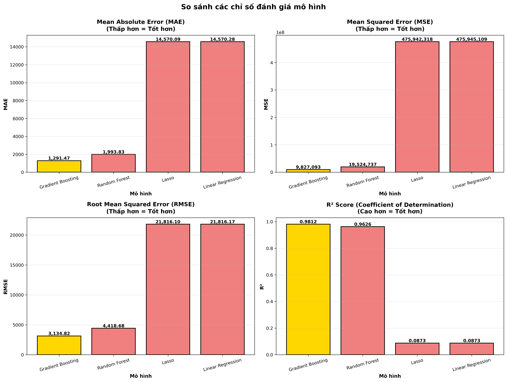
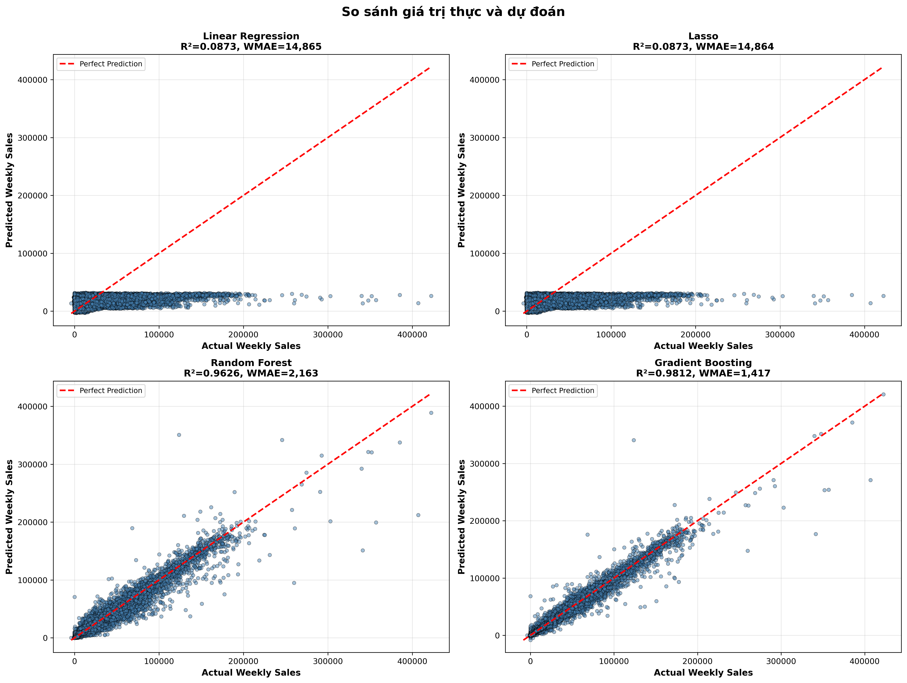
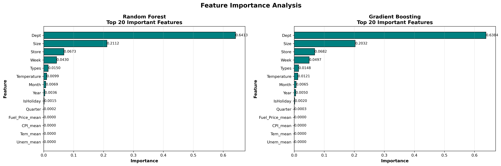

<a id="top"></a>

<p align="center">
  
</p>

<div align="center">

**PHÂN TÍCH DỮ LIỆU & DỰ BÁO DOANH SỐ BÁN LẺ**

Từ dữ liệu của 45 cửa hàng đến mô hình hồi quy và dashboard tương tác.

**[Khám phá notebook ↗](Do_An/walmart_eda_model/3122410447_LTT.ipynb)** &nbsp; · &nbsp; **[Chạy dashboard →](#quick-start)** &nbsp; · &nbsp; **[Xem kết quả ↓](#results)**

<sub>Đại học Sài Gòn · Phân tích dữ liệu · Nhóm 5 · 2025</sub>

</div>

<br />


<br />

## ◈ &nbsp; Bài toán

**Doanh số thay đổi như thế nào — và có thể dự đoán đến đâu?**

Dự án khám phá doanh số hàng tuần của chuỗi cửa hàng **Walmart**: nhận diện xu hướng theo thời gian, so sánh hiệu suất cửa hàng và tìm hiểu mối liên hệ với ngày lễ, khuyến mãi cùng các yếu tố kinh tế. Biến mục tiêu là **`Weekly_Sales`**, được phân tích theo từng cửa hàng và bộ phận.

<p align="center">
  <a href="#experience">Dashboard</a> &nbsp; / &nbsp;
  <a href="#workflow">Quy trình</a> &nbsp; / &nbsp;
  <a href="#results">Mô hình</a> &nbsp; / &nbsp;
  <a href="#data">Dữ liệu</a> &nbsp; / &nbsp;
  <a href="#quick-start">Cài đặt</a> &nbsp; / &nbsp;
  <a href="#structure">Cấu trúc</a>
</p>

<br />

<a id="experience"></a>

## ⌘ &nbsp; Một bộ dữ liệu. Nhiều góc nhìn.

<table>
<tr>
<td width="50%" valign="top">
<h3>01 &nbsp; Khám phá kinh doanh</h3>
<p>Tổng quan doanh số, phân phối dữ liệu và hiệu suất từng cửa hàng, bộ phận.</p>
<sub>OVERVIEW · EDA · STORE PERFORMANCE</sub>
</td>
<td width="50%" valign="top">
<h3>02 &nbsp; Đọc xu hướng thời gian</h3>
<p>Theo dõi biến động doanh số, yếu tố mùa vụ và sự khác biệt giữa tuần có ngày lễ với tuần thông thường.</p>
<sub>TIME ANALYSIS · HOLIDAY ANALYSIS</sub>
</td>
</tr>
<tr>
<td width="50%" valign="top">
<h3>03 &nbsp; Tìm mối liên hệ</h3>
<p>Khám phá tương quan của doanh số với nhiệt độ, giá nhiên liệu, CPI và tỷ lệ thất nghiệp.</p>
<sub>CORRELATION · ECONOMIC FEATURES</sub>
</td>
<td width="50%" valign="top">
<h3>04 &nbsp; Thử nghiệm dự đoán</h3>
<p>Chọn cửa hàng, bộ phận và các đầu vào để ước lượng doanh số hàng tuần bằng Gradient Boosting.</p>
<sub>MACHINE LEARNING · SALES PREDICTION</sub>
</td>
</tr>
</table>

<br />

<a id="workflow"></a>

## ⤷ &nbsp; Từ dữ liệu đến dự đoán


Ghép dữ liệu theo **cửa hàng, ngày và cờ ngày lễ**; xử lý giá trị thiếu; tạo đặc trưng thời gian; so sánh mô hình hồi quy và trình bày phân tích trên Streamlit.


<details>
<summary><strong>Các thư viện hỗ trợ</strong></summary>

NumPy hỗ trợ tính toán; Matplotlib và Seaborn phục vụ biểu đồ trong notebook; Statsmodels hỗ trợ phân tích thống kê; Joblib dùng để lưu mô hình. Xem danh sách tại [`requirements.txt`](Do_An/walmart_eda_model/requirements.txt).

</details>

<br />

<a id="results"></a>

## ◇ &nbsp; Model showcase

**Bốn mô hình. Cùng một bài toán dự báo.**

`Linear Regression` &nbsp; `Lasso` &nbsp; `Random Forest` &nbsp; `Gradient Boosting`

Notebook so sánh mô hình bằng **MAE · MSE · RMSE · R² · WMAE** và chọn mô hình tốt nhất theo **WMAE** — sai số tuyệt đối trung bình có trọng số.

<p align="center">
  
</p>

<p align="center"><sub>Kết quả thực nghiệm đã lưu trong dự án, không phải số liệu từ một lần huấn luyện mới.</sub></p>

<details>
<summary><strong>↗ &nbsp; Mở bộ biểu đồ đánh giá chi tiết</strong></summary>

### Thực tế so với dự đoán



### Mức độ quan trọng của đặc trưng



</details>

<details>
<summary><strong>↗ &nbsp; Mô hình đã lưu & cách dashboard dự đoán</strong></summary>

Notebook có bước lưu mô hình bằng `joblib`. Liên kết tải mô hình nằm trong [`Do_An/readme.md`](Do_An/readme.md); các tệp `.pkl` được loại khỏi Git.

Dashboard sử dụng **Gradient Boosting**, chỉ huấn luyện khi bấm **Tạo dự đoán** và lưu mô hình trong bộ nhớ đệm Streamlit. Không cần tải tệp `.pkl` để chạy dashboard; lần huấn luyện đầu có thể mất vài phút tùy máy. Kết quả luôn ghi rõ kịch bản đã gửi, kể cả khi bạn tiếp tục chỉnh biểu mẫu.

</details>

<br />

<a id="data"></a>

## ▤ &nbsp; Bên trong bộ dữ liệu

| Nguồn | Số bản ghi | Nội dung |
| :--- | ---: | :--- |
| [`train.csv`](Do_An/dataset/train.csv) | **421.570** | Doanh số theo cửa hàng, bộ phận và tuần; có `Weekly_Sales` |
| [`test.csv`](Do_An/dataset/test.csv) | **115.064** | Các bản ghi cần dự đoán; không có doanh số thực tế |
| [`stores.csv`](Do_An/dataset/stores.csv) | **45** | Loại và quy mô cửa hàng |
| [`features.csv`](Do_An/dataset/features.csv) | **8.190** | Nhiệt độ, nhiên liệu, khuyến mãi, CPI, thất nghiệp, ngày lễ |

> **Ghi chú đánh giá:** tập dùng để đánh giá mô hình được tách từ `train.csv`. Tệp `test.csv` không chứa `Weekly_Sales`. Số bản ghi trong bảng không bao gồm tiêu đề.

<br />

<a id="quick-start"></a>

## ↗ &nbsp; Khởi chạy dự án

Có **Python** và **pip**, mở terminal tại thư mục gốc `LTT_DA/`.

### 01 / Cấu hình môi trường dự án

Từ thư mục gốc, chạy bằng Python 3.12:

```powershell
python run_project.py setup
```

Lệnh tạo `.venv/`, cài thư viện dashboard và Jupyter, đăng ký kernel **Python (Walmart)** trong môi trường này rồi kiểm tra import và một lượt fit/predict nhỏ. Không cần kích hoạt PowerShell; môi trường `myvenv` cũ không được sử dụng.

### 02 / Mở dashboard

```powershell
python run_project.py dashboard
```

Mở **Local URL** trong terminal. Bộ lọc **loại cửa hàng / năm / tháng** nằm dưới tiêu đề; không còn bộ lọc khoảng ngày. Chỉnh bộ lọc không đưa trang về đầu; chỉ đổi mục phân tích mới cuộn lên đầu. Các lựa chọn được giữ khi chuyển trang.

Trang **Dự đoán doanh số** tự huấn luyện Gradient Boosting khi bấm **Tạo dự đoán**, không cần chạy notebook trước. Lần huấn luyện đầu có thể mất vài phút.

### 03 / Mở hoặc chạy notebook

Notebook thực tế của project là **`3122410447_LTT.ipynb`**:

```powershell
python run_project.py notebook
```

Mở URL Jupyter có token mà terminal hiển thị, chọn kernel **Python (Walmart)** và chạy các ô theo thứ tự. Notebook tự tìm dữ liệu từ project root; không còn phụ thuộc đường dẫn `../dataset/` của working directory.

Để chạy toàn bộ notebook bằng dòng lệnh và lưu kết quả mới riêng:

```powershell
python run_project.py execute
```

Mỗi lượt chạy tạo thư mục `artifacts/notebook/<thời-gian>/`, gồm notebook có output, biểu đồ và model nếu huấn luyện thành công. File nguồn và các ảnh kết quả cũ không bị ghi đè. Chạy thủ công trong Jupyter ghi artifact vào `artifacts/notebook/manual/`.

Nếu không tạo được dự đoán hoặc kernel báo lỗi:

```powershell
python run_project.py doctor
```

Nếu log ghi **Application Control policy has blocked this file**, Windows đang chặn thư viện Python/SciPy/scikit-learn. Cần quản trị thiết bị cho phép thư viện chính thức theo chính sách của máy; chạy lại notebook không khắc phục việc hệ điều hành từ chối tải DLL. Các script của project không sửa chính sách bảo mật.

### Kiểm tra ứng dụng

```powershell
.\.venv\Scripts\python.exe -m unittest discover -s tests -v
node --test tests/test_navigation.cjs
```

Test UI dùng CSV thật và estimator giả lập cho biểu mẫu dự đoán; test JavaScript dùng DOM giả lập. Chúng không thay thế huấn luyện model thật hoặc kiểm tra cuộn trang bằng trình duyệt.


<br />

<a id="structure"></a>

## ⌁ &nbsp; Project map

```text
LTT_DA/
├── README.md
├── .streamlit/config.toml          # Theme ứng dụng và sidebar
├── tests/test_dashboard.py         # Kiểm tra UI và số liệu tổng hợp
├── assets/readme/                  # Bộ nhận diện cho README
└── Do_An/
    ├── readme.md                   # Liên kết tải mô hình
    ├── dataset/                    # train · test · stores · features
    └── walmart_eda_model/
        ├── 3122410447_LTT.ipynb    # Phân tích & huấn luyện
        ├── streamlit_dashboard.py # Dashboard tương tác
        ├── dashboard_ui.py        # Thành phần giao diện và theme Plotly
        ├── dashboard.css          # Bố cục, màu sắc, responsive
        ├── navigation.js          # Đưa nội dung về đầu khi đổi trang
        ├── Walmart-Logo-New.png    # Logo Walmart
        ├── requirements.txt       # Thư viện Python
        ├── all_metrics_comparison.png
        ├── actual_vs_predicted.png
        └── feature_importance.png
```

<br />

---

<div align="center">

<sub>THE PERSON BEHIND THE PROJECT</sub>

### Lương Thanh Tuấn

**3122410447** &nbsp; / &nbsp; Nhóm 5 &nbsp; / &nbsp; Đại học Sài Gòn

Giảng viên: **Do Nhu Tai** · Học phần Phân tích dữ liệu · **2025**

<br />

**EXPLORE PATTERNS. PREDICT POSSIBILITIES.**

<sub>[↑ Về đầu trang](#top)</sub>

</div>
